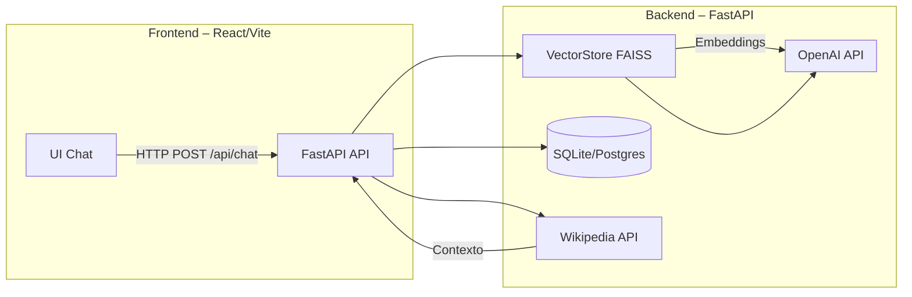

# 🧠 Mini RAG Assistant – FastAPI + OpenAI + FAISS + React


Asistente **RAG** (Retrieval-Augmented Generation) minimalista para entrevistas técnicas.  
Incluye **backend** con FastAPI y FAISS, y **frontend** en React/Vite.  
Permite chatear con un modelo OpenAI, recuperar contexto desde documentos locales y usar herramientas externas como Wikipedia.

---

## ✨ Características

- **Chat con OpenAI API** (GPT-4, GPT-3.5, etc.)
- **RAG local** con FAISS (persistente en `./data`).
- **Tool calling** a Wikipedia.
- **API REST** (`/api/chat`, `/api/ingest`, `/api/health`).
- **Base de datos** SQLite por defecto (Postgres opcional vía Docker Compose).
- **Frontend** simple con React/Vite para chatear.

---

## 🏗 Arquitectura



---

## 🚀 Ejecución rápida (SQLite, sin Docker)

```bash
cd backend
cp .env.example .env
# Edita .env y añade tu OPENAI_API_KEY
python -m venv .venv && source .venv/bin/activate
pip install -r requirements.txt
uvicorn app.main:app --reload --host 0.0.0.0 --port 8000
```

Frontend:
```bash
cd frontend
npm install
npm run dev -- --host
```
- Backend: http://localhost:8000  
- Frontend: http://localhost:5173

---

## 🐳 Docker Compose (Postgres + API + Web)

```bash
cp backend/.env.example backend/.env
# Añade tu OPENAI_API_KEY en backend/.env
docker compose up --build
```
- Backend: http://localhost:8000  
- Frontend: http://localhost:5173

---

## 📡 Endpoints principales

| Método | Endpoint       | Descripción |
|--------|---------------|-------------|
| GET    | `/api/health` | Estado del servicio |
| POST   | `/api/chat`   | Envía mensaje al asistente |
| POST   | `/api/ingest` | Sube archivo y guarda embeddings |

---

## 💬 Ejemplos rápidos

Chat simple:
```bash
curl -X POST http://localhost:8000/api/chat \
  -H "Content-Type: application/json" \
  -d '{"message":"Hola, ¿qué puedes hacer?", "use_rag": false}'
```

Ingesta + RAG:
```bash
curl -X POST http://localhost:8000/api/ingest -F "file=@notas.txt"

curl -X POST http://localhost:8000/api/chat \
  -H "Content-Type: application/json" \
  -d '{"message":"¿Qué tecnologías usa el proyecto?", "use_rag": true}'
```

---

## 📂 Estructura del proyecto

```
backend/
  app/
    main.py         # API principal
    rag/            # Chunker y VectorStore (FAISS)
    db/             # Modelos SQLAlchemy
    tools/          # Herramientas externas (Wikipedia)
  requirements.txt
frontend/
  src/App.jsx       # UI de chat
docker-compose.yml  # Orquesta servicios
```

---

## 🔑 Variables de entorno (`.env`)

```env
OPENAI_API_KEY=tu_api_key_aqui
OPENAI_MODEL=gpt-4o-mini
EMBEDDING_MODEL=text-embedding-3-small
DATABASE_URL=sqlite:///./app.db
```

---

## 🧪 Roadmap

- [ ] Autenticación de usuarios
- [ ] Carga de PDFs y CSV
- [ ] Streaming de respuestas (SSE)
- [ ] Observabilidad (Prometheus/Grafana)
- [ ] VectorStore opcional: ChromaDB, MongoDB Atlas

---

## 📜 Licencia
MIT – uso libre con atribución.

---

> 💡 **Consejo para entrevistas:** Usa este repo como base, prepara un guion de 5–7 min y enfatiza decisiones técnicas (por qué FAISS, chunking, Postgres opcional, etc.).
